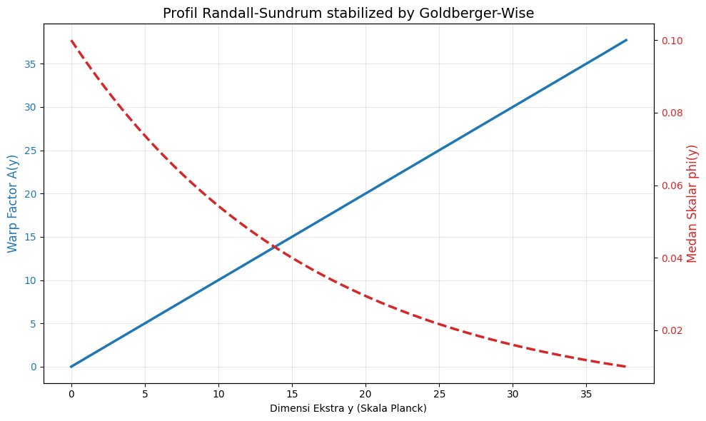

# RS-GW-JAX: Differentiable Randall-Sundrum-Goldberger-Wise Solver

## Overview

**RS-GW-JAX** is a high-precision numerical framework designed to solve the gravitational and scalar field profiles in the **Randall-Sundrum (RS)** model stabilized by the **Goldberger-Wise (GW)** mechanism. 

Built using **JAX**, this solver treats the 5D warped geometry as a differentiable system, allowing for the study of the hierarchy problem and infrared (IR) quantum corrections with machine-precision accuracy.

---

## Mathematical Framework

The repository implements the following physical model based on the Einstein-Scalar system in a 5D Anti-de Sitter ($AdS_5$) background.

### 1. Warp Factor & Redshift
The metric is defined by the warp factor $A(y)$, which determines how the 4D scales are "shrunk" as one moves along the extra dimension $y$. The analytical form provided in this model is:
$$A(y) = k y + \frac{v_{\text{UV}}^2}{12}\left(e^{4 c_2 y} - 1\right)$$
The physical redshift at the IR brane ($y_{IR}$) is given by:
$$z_{\text{IR}} = e^{-A(y_{\text{IR}})}$$

### 2. Superpotential Method
To solve the coupled Einstein-Scalar equations, we utilize the Superpotential $W(\phi)$ approach:
$$W(\phi) = W_0 + c_2 \phi^2, \quad \text{where} \quad W_0 = \frac{3k}{\kappa_5^2}$$

### 3. Differential Equations (Flow Equations)
The evolution of the bulk scalar $\phi$ and the warp factor $A$ are governed by the first-order flow equations:
$$\frac{d\phi}{dy} = 2 c_2 \phi$$
$$\frac{dA}{dy} = \frac{\kappa_5^2}{3}\left(W_0 + c_2 \phi^2\right)$$

### 4. Effective Planck Mass
The effective 4D Planck mass is derived from the integration of the warp factor over the bulk:
$$M_{\text{Pl, eff}}^2 = \int_0^{y_{\text{IR}}} dy \, e^{2A(y)}$$

### 5. Hierarchy & Volume Factors
The local volume and hierarchy suppression at a given point $y$ are defined as:
$$V_{\text{eff}}(y) = e^{-4A(y)}, \quad \epsilon(y) = \exp\big(-4 \Delta A(y)\big)$$

---

## Technical Implementation with JAX

The core novelty of this solver is the transition from static numerical methods to **Differentiable Programming**:

*   **Adaptive RK45 Integrator**: Unlike standard solvers, our JAX implementation uses `jax.lax.while_loop` to perform a **Runge-Kutta-Fehlberg** integration. This allows the solver to adjust its step size dynamically to capture the sharp gradients near the IR brane while remaining fully JIT-compiled.
*   **XLA Acceleration**: By using `jax.lax.scan`, the entire 5D evolution is compiled into a single optimized XLA kernel, enabling near-instantaneous parameter scans across the $r_c$ and $k$ space.
*   **High-Precision Analytics**: The project uses `jax_enable_x64` to maintain the 16-decimal precision required to handle the extreme scale differences (up to $10^{-17}$) inherent in the Hierarchy Problem.
*   **Self-Auditing Framework**: The code includes automated audits to ensure physical consistency, such as verifying the monotonicity of $A(y)$ and checking numerical results against the analytical solutions.

---

## Project Structure

*   `Params`: A JAX-registered Pytree dataclass containing all physical and numerical constants.
*   `rhs_system`: The physics engine calculating the derivatives based on the RS-GW equations.
*   `integrate_first_order`: The core numerical integrator.
*   `hierarchy_from_A`: Post-processing analytics for volume and hierarchy factors.

---

## Author

**Hari Hardiyan**  
*AI Enthusiast & Physics Enthusiast*  
📧 [lorozloraz@gmail.com](mailto:lorozloraz@gmail.com)

This project reflects a passion for bridging the gap between **Artificial Intelligence (Differentiable Programming)** and **High Energy Theoretical Physics**.

---

## License

This project is licensed under the MIT License - see the [LICENSE](LICENSE) file for details.

## References
1. Randall, L., & Sundrum, R. (1999). A Large Mass Hierarchy from a Small Extra Dimension.
2. Goldberger, W. D., & Wise, M. B. (1999). Modulus Stabilization with Bulk Fields.
